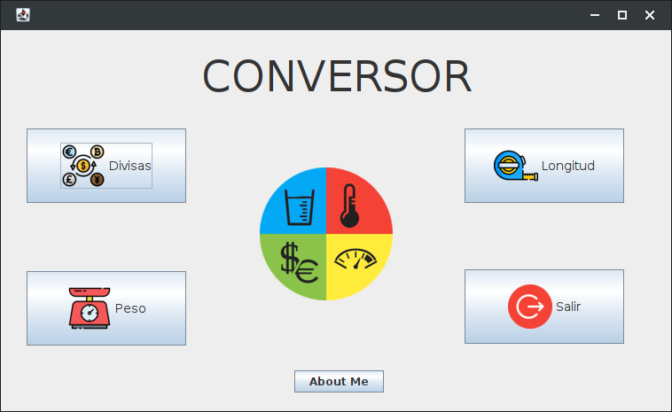
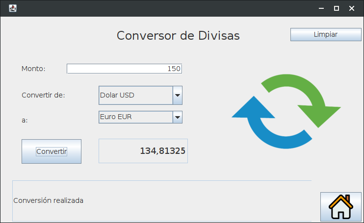
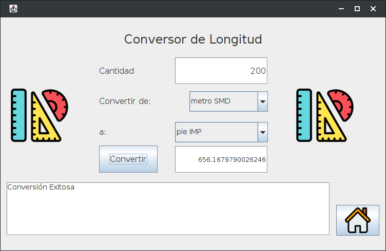
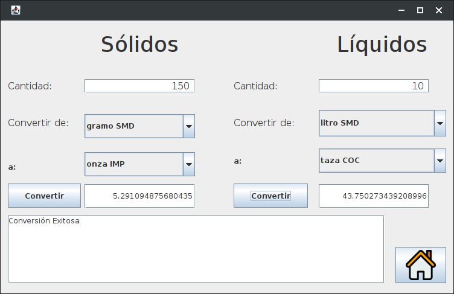
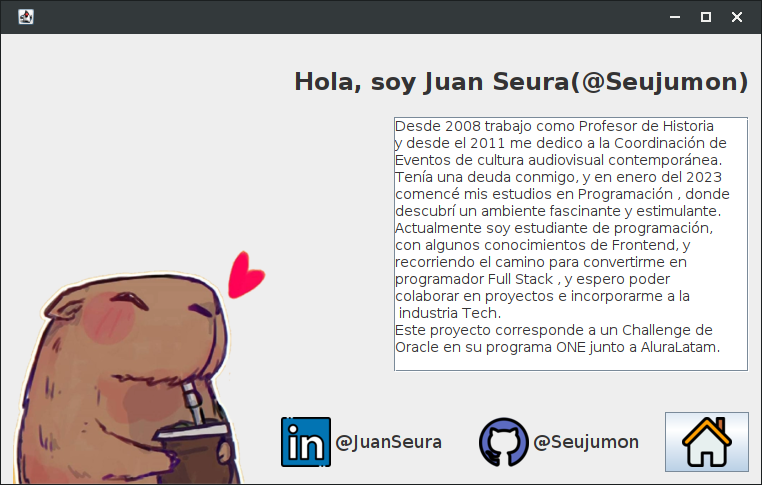

# Challenge-Conversor 

## Challenge de Oracle para su programa ONE, junto a Alura Latam. Realizado íntegramente con Java. 

#challengeoneconversorlatam5

### La Interface gráfica de usuario está realizada con Swing. Para todas las tareas, realicé una clase Servicios que es la intermediaria entre las tareas a realizar y la Interface Gráfica de Usuario. 

### Al abrir la IGU muestra las diferentes opciones para convertir que ofrece el programa. La principal es la solicitada por el ejercicio, que permite convertir diferentes divisas. 

### Para esta tarea, opté por hacer una conexión a una api externa que ofrece un servicio de conexión gratuito para pruebas de desarrollo. Así, la aplicación puede brindar datos actualizados constantemente, y al mismo tiempo me permitió investigar y aprender el funcionamiento de nuevas librerías y como manipular los datos recibidos en archivos JSON.

** API:  Exchange Rates Data API **

**Link: ** https://apilayer.com/marketplace/exchangerates_data-api#documentation-tab    

### Las demás conversiones fueron realizadas mediante valores constantes almacenados en diferentes ENUM, de acuerdo a las especificaciones del sistema de medición y la unidad de medida usada. 

### En todos los casos, realicé las validaciones que creí necesarias de los datos ingresados, y ejercité el uso de las Exceptions para intentar mantener el correcto funcionamiento del programa. 

 

### El agregado de la sección About Me, fue para dejar constancia de la realización personal del proyecto 

 

### Para este proyecto fue de mucha utilidad el material de los cursos de programación de Alura, así como el material extra. Pero además, para realizar ciertas tareas como el uso de Swing o la conección con la api fueron de gran ayuda los videos de Luisina De Paula de TodoCode y del canal GOGODEV de Juanjo Ruiz y Álex Ruiz

